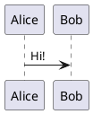

# Silver Bullet plug for PlantUML diagrams

This plug adds basic [PlantUML](https://www.plantuml.com) support to Silver Bullet.

## Installation

Run the {[Plugs: Add]} command and paste in: `github:logeshg5/silverbullet-plantuml/plantuml.plug.js`

## Configuration

There are three types of configuration possible

1. [Remote Server](#1-remote-server-configuration)
2. [Local Server](#2-local-server-configuration)
3. [Script](#3-script-configuration)

### 1. Remote Server Configuration

Add this to your `SETTINGS.md`

```yaml
plantuml:
  serverurl: https://plantuml.com
```

This configuration uses the offical PlantUML server to generate the diagram. If you do not want to send the data to PlantUML server check other configuration options.

### 2. Local Server Configuration

[PlantUML](https://plantuml.com/download) needs to be installed in your machine at e.g., `/usr/local/bin/plantuml.jar`. Ensure you have the JDK installed on your system.

Launch a local PlantUML [http server](https://plantuml.com/picoweb).

```bash
java -jar /usr/local/bin/plantuml.jar -picoweb:8080
```

Add this to your `SETTINGS.md`

```yaml
plantuml:
  serverurl: http://localhost:8080
```

This configuration uses the local PlantUML server to generate the diagram. This doesn't send the data to PlantUML server. You will have to keep the local server running always.

### 3. Script Configuration

[PlantUML](https://plantuml.com/download) needs to be installed in your machine at e.g., `/usr/local/bin/plantuml.jar`. Ensure you have the JDK installed on your system.

The configured script is run with plantuml data encoded in base64 format as argument.

Create a helper script that decodes the input data and generate diagram. Copy the below contents to a script at e.g., `/usr/local/bin/gen_plantuml_svg`

Helper scripts for Linux & Windows can be found in [scripts](scripts) directory. Take a note to update the plantuml.jar paths.

```bash
#!/bin/bash
echo -e $1 | base64 -d | java -jar /usr/local/bin/plantuml.jar -tsvg -pipe
```

Make it an executable by running the following command

```bash
chmod a+x /usr/local/bin/gen_plantuml_svg
```

In your `SETTINGS.md` configure the path to the generator.

```yaml
plantuml:
  generator: /usr/local/bin/gen_plantuml_svg
```

This helper script is needed as I couldn't get to call the plantuml.jar directly from this plugin.

## Use

Put a plantuml block in your markdown:

````

````

And move your cursor outside of the block to live preview it!
