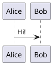

# Silver Bullet plug for PlantUML diagrams

This plug adds basic [PlantUML](https://www.plantuml.com) support to Silver Bullet.

## Installation

Run the {[Plugs: Add]} command and paste in: `github:logeshg5/silverbullet-plantuml/plantuml.plug.js`

### PlantUML Installation

[PlantUML jar](https://plantuml.com/download) needs to be installed in your machine. Ensure you have the JDK installed on your system.

### Setup Helper Script

Create an executable that helps generate diagrams in svg format.

Copy the below contents to a script at e.g., `/usr/local/bin/gen_plantuml_svg`

```bash
#!/bin/bash
echo -e $1 | base64 -d | java -jar /usr/local/bin/plantuml.jar -tsvg -pipe
```

Make it an executable by running the following command

```bash
chmod a+x /usr/local/bin/gen_plantuml_svg
```

This helper script is needed as I couldn't get to call the plantuml.jar directly from this plugin.

### Settings Update

In your `SETTINGS.md` configure the path to the generator.

```yaml
plantuml:
  generator: /usr/local/bin/gen_plantuml_svg
```

## Use

Put a plantuml block in your markdown:



And move your cursor outside of the block to live preview it!
